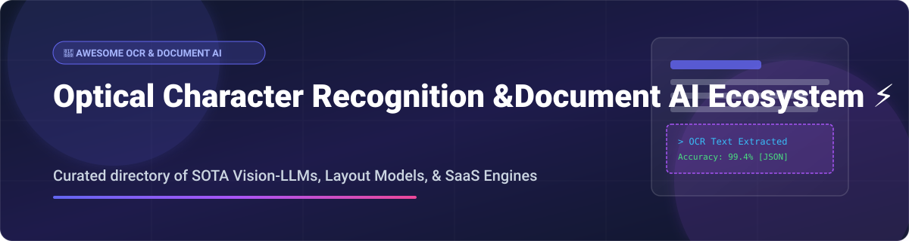

  

# 🚀 Awesome Optical Character Recognition (OCR) & Document AI Ecosystem 📄✨

  
  
  
  
  

---

## 💡 Overview & Ecosystem Insights

**A curated, production-ready directory of Intelligent Document Processing (IDP), Optical Character Recognition (OCR) platforms, Vision-Language Models (VLMs), and document layout parsing engines.**

Whether you are building RAG pipelines for PDF ingestion, enterprise financial document extractors (invoices, receipts, tax forms), or privacy-first edge OCR models, this list highlights state-of-the-art SaaS solutions and open-source GitHub projects.

- **📅 Last Updated:** October 2026
- **🔍 Primary Domains:** Document AI, Multilingual OCR, Table Structure Recognition (TSR), Layout Analysis, Schema-Constrained Extraction, PDF Parsing, Vision-LLMs.

---

## 📌 Table of Contents

- [☁️ SaaS / Hosted IDP Platforms](#-saas--hosted-idp-platforms)
- [🔓 Open-Source GitHub Projects](#-open-source-github-projects)
  - [🤖 Document AI & Vision-LLM Frameworks](#-document-ai--vision-llm-frameworks)
  - [⚙️ Core OCR Engines & Toolkit](#️-core-ocr-engines--toolkit)
  - [📊 Structured Extraction & Schema Parsers](#-structured-extraction--schema-parsers)
  - [📑 PDF Ingestion & Document Conversion](#-pdf-ingestion--document-conversion)
  - [⚡ Edge OCR & Compact VLMs](#-edge-ocr--compact-vlms)
- [🤝 How to Contribute](#-how-to-contribute)
- [💖 Support & Community](#-support--community)
- [📈 Star History](#-star-history)
- [⚠️ Disclaimer](#️-disclaimer)

---

## ☁️ SaaS / Hosted IDP Platforms

The global Intelligent Document Processing (IDP) market size is estimated between **$3.17 billion and $4.31 billion in 2026** (projected to reach over $13 billion to $44 billion by the mid-2030s). The sector is **moderately fragmented**, comprising cloud hyper-scalers, legacy IDP enterprises, and specialized AI-native startups targeting distinct domain workflows.

| Platform | Description | Pricing | Free Tier / Trial Limit | Company Scale (Valuation / Market Cap / Revenue) |
| :--- | :--- | :--- | :--- | :--- |
| **[Azure AI Document Intelligence](https://azure.microsoft.com/en-us/products/ai-services/ai-document-intelligence)** | Microsoft's document processing service with pre-built and custom extraction models. | Starts at $1.50 per 1,000 pages (Read OCR) / $10.00 per 1,000 pages (Prebuilt). | 500 pages/month free (max 2 pages per document, 4 MB limit). | **~$3.1 Trillion** (Microsoft Market Cap) |
| **[Google Cloud Document AI](https://cloud.google.com/document-ai)** | Google's document understanding platform for invoices, receipts, forms, and custom extraction. | Starts at $1.50 per 1,000 pages (OCR) / $30.00 per 1,000 pages (Form Parser). | $300 free credits valid for 90 days (No permanent free tier). | **~$2.2 Trillion** (Alphabet Market Cap) |
| **[Amazon Textract](https://aws.amazon.com/textract/)** | AWS's ML document text and data extraction service for forms, tables, and structured data. | Starts at $1.50 per 1,000 pages (Detect Text) / $15.00 per 1,000 pages (Tables). | 1,000 text pages/month for 1st 3 months after account creation. | **~$2.0 Trillion** (Amazon Market Cap) |
| **[Hyperscience](https://www.hyperscience.com/)** | Enterprise intelligent document processing with human-in-the-loop automation. | Enterprise contracts start at ~$150,000/year (custom quote only). | No public free trial (Demo by request). | **~$1.6 Billion** (Valuation) / $439M total funding |
| **[Rossum](https://rossum.ai/)** | AI-powered document automation for invoice and purchase order processing. | Starter plan starts at $18,000/year ($1,500/month). | 14-day free trial (up to 300 documents limit). | **~$510 Million** (Valuation) / Acquired by Coupa / ~$44.9M ARR |
| **[Nanonets](https://nanonets.com/)** | No-code AI document processing for invoices, receipts, and forms. | Starter plan at $100/month for 100 credits (~$0.02–$0.30 per run). | $50 free credits upon signup (no expiration). | **~$500 Million** (Estimated Valuation) / $42M funding / ~$100M ARR |
| **[ABBYY Vantage](https://www.abbyy.com/)** | Intelligent document processing platform for enterprise document automation. | Entry enterprise contracts start at $8,000–$10,000/year (per-page $0.02–$0.20). | 60-day free trial (limit ~2,000–3,000 pages). | **~$300 Million+** (Estimated Enterprise Value) / 60% Vantage ARR growth |
| **[Veryfi OCR API](https://www.veryfi.com/)** | Real-time document extraction API for receipts, invoices, and financial docs. | Starter plan at $500/month minimum ($0.08/receipt, $0.16/invoice). | 100 documents/month free forever (14-day trial for API expansion). | **~$60 Million - $100 Million** (Estimated Valuation) / $12.8M funding |
| **[Klippa DocHorizon](https://www.klippa.com/)** | OCR and data extraction for receipts, invoices, and identity documents. | Usage-based / license quote per document volume. | €25 free credits upon registration. | **~$21.5 Million ARR** (Private company, 89+ employees) |
| **[Base64.ai](https://base64.ai/)** | Document AI platform supporting 500+ document types. | Starts at usage-based custom tier for 1,000+ pages/month. | 100 free credits for API testing (Mock API available). | **~$2.5 Million ARR** / $1.8M Seed funding |

---

## 🔓 Open-Source GitHub Projects

Sorted by GitHub_Stars (descending order).

### 🤖 Document AI & Vision-LLM Frameworks

- **[Tesseract OCR](https://github.com/tesseract-ocr/tesseract)**   
  **The foundational open-source OCR engine**, Apache-2.0 licensed. Supports 100+ languages with LSTM-based line recognition. Best for general-purpose OCR integration.

- **[PaddleOCR](https://github.com/PaddlePaddle/PaddleOCR)**   
  **Awesome multilingual OCR toolkit based on PaddlePaddle**, supporting 80+ languages, layout analysis, table recognition, and compact edge deployment models (PaddleOCR-VL).

- **[EasyOCR](https://github.com/JaidedAI/EasyOCR)**   
  **Ready-to-use OCR with 80+ languages**, Apache-2.0 licensed. Provides a clean Python API with CRAFT text detection and ResNet-LSTM recognition.

- **[Marker](https://github.com/VikParuchuri/marker)**   
  **Convert PDF to Markdown and JSON rapidly**, GPL-3.0 licensed. Optimized for speed and accuracy in LLM ingestion and RAG document preparation.

- **[PyMuPDF](https://github.com/pymupdf/PyMuPDF)**   
  **High-performance PDF parsing and document manipulation library** (MuPDF bindings). Best for fast text extraction, vector graphics, and image extraction.

- **[Docling](https://github.com/docling-project/docling)**   
  **The leading open-source document processing framework from IBM Research**, MIT licensed. Converts complex PDFs and scanned documents into structured JSON/Markdown with reading order preservation, table recognition, and visual grounding.

- **[OCRmyPDF](https://github.com/ocrmypdf/OCRmyPDF)**   
  **Adds an OCR text layer to scanned PDF files**, enabling text selection, searchability, and archiving while preserving original visual layout.

- **[Surya](https://github.com/VikParuchuri/surya)**   
  **Document OCR, layout analysis, reading order, and table extraction** using a 0.7B parameter multilingual model.

- **[DocTR](https://github.com/mindee/doctr)**   
  **Seamless 2-stage OCR library with structured JSON output** (blocks, lines, words, bounding boxes). Built on PyTorch and TensorFlow.

- **[Apache Tika](https://github.com/apache/tika)**   
  **Universal content analysis toolkit** — extracts metadata and structured text content from over 1,000 different file types.

- **[olmOCR](https://github.com/allenai/olmocr)**   
  **Allen AI's industrial-scale PDF digitization tool** based on 7B Vision-LLMs. Digitizes one million PDF pages for ~$190.

- **[RapidOCR](https://github.com/RapidAI/RapidOCR)**   
  **Cross-platform, lightweight OCR toolkit based on PaddleOCR**, optimized for CPU and mobile runtimes via ONNX Runtime and NNN.

- **[MinerU](https://github.com/opendatalab/MinerU)**   
  **OpenDataLab's open-source PDF extraction tool** converting complex scientific PDFs, formulas, and tables into structured Markdown.

- **[TrOCR](https://github.com/microsoft/unilm/tree/master/trocr)**   
  **Microsoft's Transformer-based OCR model** combining pre-trained vision and language models. Best for printed and handwritten text recognition.

- **[Qianfan-OCR](https://huggingface.co/rootlocalghost/Qianfan-OCR)**  
  **Baidu Qianfan Team's 4B-parameter end-to-end document intelligence model** achieving top benchmark scores across 192 languages.

- **[lift](https://huggingface.co/datalab-to/lift)**  
  **Structured extraction model from Datalab** pulling structured JSON from PDFs using schema-constrained decoding.

- **[NuExtract3](https://huggingface.co/numind/NuExtract3)**  
  **NuMind's schema-driven structured extraction model**, supporting in-context field definitions and zero-shot extractions.

- **[TinyDoc-VLM](https://pypi.org/project/tinydoc-vlm/)**  
  **256M-parameter document-specialist VLM** running on CPU, Raspberry Pi 5, or MacBooks with <1GB VRAM.

---

## 🛠️ How to Contribute

Contributions are welcome! Help us keep this directory accurate and updated:

1. 🍴 Fork the repository.
2. 📝 Add or update entries in `README.md` using standard markdown formatting.
3. 🔗 Include official homepage/GitHub repository link, Stars_Badge, concise description, and license details.
4. 🚀 Open a Pull Request with a clear summary of your additions.

Please ensure all added open-source projects have active maintenance and clear open-source licensing.

---

## 💖 Support & Community

If you find this repository helpful for your document processing, OCR research, or RAG architecture, please consider supporting the project:

- ⭐ **Star this repository** to help others discover it!
- 🔀 **Fork & Share** with your colleagues and document processing community.
- 💬 **Join our Discord** to discuss Document AI, OCR models, and VLM pipelines: [Join Discord Community](https://discord.gg/jc4xtF58Ve)
- ☕ **Sponsor the Maintainer**: Support ongoing curation and open-source contributions via [GitHub Sponsors](https://github.com/sponsors/ishandutta2007).

---

## 📈 Star History

---

## ⚠️ Disclaimer

- This repository is a **community-curated index** for informational and educational purposes.
- Document AI models process sensitive enterprise data; always implement proper data security, access management, and privacy compliance (GDPR, HIPAA, SOC 2).
- Benchmark scores (such as OmniDocBench or olmOCR-bench) reflect specific evaluation datasets; test models against your custom document workloads prior to production deployment.

---

  <b>Curated with ❤️ for AI Engineers, Document Automation Architects, & Vision-LLM Researchers.</b>

